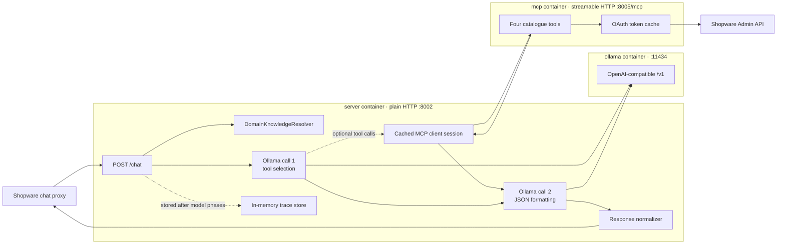

# Backend code walkthrough

## Purpose and scope

This document explains the backend repository at
`/home/paul/shopware-ollama-mcp`. It covers the FastAPI chat gateway, local
domain knowledge, Ollama calls, MCP transport, Shopware Admin API access,
response normalization, tracing, Docker layout, and safe validation.

It intentionally stops at the repository boundary. Storefront rendering,
authoritative price resolution, chat/contact tracking, email, and durable
application persistence belong to the Shopware repository and should be read
in the primary cross-repository architecture document. This backend has no
price, contact-submission, tracking, customer, order, or persistence endpoint.

The contracts below are derived from the `stage` branch source and read-only
runtime inspection on 2026-07-27. Source code is authoritative when older
meeting notes under `docs/text*.txt` describe intended or historical behavior.

## Runtime at a glance



Two details are easy to miss:

- A normal chat makes exactly two model calls, even when the first call does
  not request a tool.
- The MCP layer uses the Shopware Admin API. It does not execute in a
  storefront `SalesChannelContext`, so it is not authoritative for
  customer-specific prices or sales-channel visibility.

## Repository map

```text
shopware-ollama-mcp/
├── app.py
│   FastAPI routes, environment parsing, prompts, Ollama orchestration,
│   MCP client session, response normalization, and trace storage.
├── shopware_mcp_server.py
│   Streamable-HTTP MCP server, Shopware OAuth, Admin API helpers, and
│   four normalized catalogue tools.
├── backend/
│   ├── app/services/
│   │   ├── domain_knowledge_models.py
│   │   │   Sanitized term and match dataclasses.
│   │   ├── domain_knowledge_loader.py
│   │   │   Provider protocol and JSON file loader.
│   │   ├── domain_knowledge_resolver.py
│   │   │   Exact, phrase, and fuzzy matching indexes.
│   │   └── domain_knowledge_prompt.py
│   │       Deterministic rendering of resolved matches as system context.
│   └── data/domain_terms.json
│       Operator-managed domain catalogue; 42 entries at inspection time.
├── compose.yaml
│   Ollama, MCP, and chat service definitions plus ports and bind mounts.
├── Dockerfile
│   Shared Python 3.12/uv image used by both Python services.
├── scripts/rebuild_ollama_aliases.sh
│   Optional operator command that creates Ollama aliases with baked num_ctx.
├── pyproject.toml / uv.lock
│   Declared dependencies and resolved versions.
├── README.md
│   Entry-level setup and endpoint overview.
├── docs/text*.txt
│   Project/meeting notes, not executable contracts.
└── main.py
    Unused project scaffold; production does not start here.
```

Two relevant directories are ignored by Git:

- `test/` contains useful `unittest` contract and domain-resolver tests, but
  `.gitignore` currently excludes the complete directory. A fresh clone does
  not receive those tests.
- `old/` contains a historical `app.py`. It is not imported or copied into the
  tracked application contract and should not be used to explain current
  behavior.

### Resolved Python stack

`pyproject.toml` declares lower bounds, while `uv.lock` and the current virtual
environment resolve the runtime to:

| Package/runtime | Resolved version |
| --- | --- |
| Python | 3.12 |
| FastAPI | 0.121.1 |
| Uvicorn | 0.38.0 |
| Pydantic | 2.12.4 |
| OpenAI Python client | 2.7.1 |
| MCP SDK | 1.21.0 |
| HTTPX | 0.28.1 |
| python-dotenv | 1.2.1 |

In MCP SDK 1.21.0, `mcp.types.JsonContent` is unavailable. The guarded import
therefore sets `JsonContent = None`, and the four current MCP functions return
plain dictionaries for FastMCP to serialize.

## Startup and container layout

### Compose services

| Service | Image/command | Host port | Internal dependency |
| --- | --- | ---: | --- |
| `ollama` | `ollama/ollama:0.17.1-rc2` | `11434` | NVIDIA GPU and persistent `ollama_data` |
| `mcp` | Shared backend image; `python shopware_mcp_server.py` | `8005` | Shopware Admin API |
| `server` | Shared backend image; `uvicorn app:app --host 0.0.0.0 --port 8002` | `8002` | `mcp` and `ollama` |

All three published endpoints use plain HTTP in the current local Compose
topology. `depends_on` controls start order only; no Compose health checks prove
that Ollama, MCP, or Shopware is ready.

### `/app` is a container path

The Dockerfile copies source into `/app` at build time, but both Python
services then bind-mount the repository root at `/app`:

```text
WSL host                                       Container
/home/paul/shopware-ollama-mcp/app.py      -> /app/app.py
/home/paul/shopware-ollama-mcp/backend/... -> /app/backend/...
```

Consequently, the live health value
`/app/backend/data/domain_terms.json` refers to the host file
`backend/data/domain_terms.json`. It is not a missing WSL directory.

The virtual environment lives separately at `/opt/venv`, so the `/app` bind
mount does not hide installed packages. The image runs as UID 10001
(`appuser`). The Ollama model store uses the named `ollama_data` volume, and a
host GGUF directory is mounted read-only at `/models`.

Although `.dockerignore` prevents `.env` from being copied into an image layer,
its exact-name pattern does not exclude `.env.local`. The Dockerfile's
`COPY . /app` can therefore include the tracked `.env.local` in the shared
Python image. At runtime the bind mount also makes the host repository visible
at `/app`, while Compose injects `.env` through each Python service's
`env_file`.

`.gitignore` does not affect the Docker build context. The locally ignored
`test/` and `old/` directories are likewise available to `COPY` and to the
runtime bind mount unless `.dockerignore` excludes them.

### Environment-file precedence

`compose.yaml` explicitly names `.env` as the `env_file` for `server` and
`mcp`. The Make target uses:

```bash
docker compose --env-file .env.local up -d
```

Compose's CLI `--env-file` supplies variable interpolation inputs; it does not
replace the literal service-level `env_file: .env` in this Compose file.
Read-only inspection confirmed that the running service uses the `.env`
values, not the differing model/context values in `.env.local`.

At inspection time `.env.local` was a tracked file and declared
credential-bearing keys. No values are reproduced here. Keeping credentials
out of version control and reviewing whether tracked credentials require
rotation is future security work, not a change made during this documentation
pass.

### FastAPI import sequence

Uvicorn imports `app.py`, which performs these operations synchronously:

1. `load_dotenv()` loads a root `.env` when the process environment has not
   already supplied a key.
2. Environment strings are parsed into module constants.
3. Context and model-alias maps are built.
4. One OpenAI client is configured for Ollama.
5. One lazy MCP session cache is created.
6. The domain JSON is eagerly loaded and indexed. A failure is logged and
   degrades to `domain_knowledge_resolver = None`.
7. CORS middleware and FastAPI routes are registered.

The MCP process separately imports `shopware_mcp_server.py`. It refuses to
start unless `SHOPWARE_BASE_URL`, `SHOPWARE_CLIENT_ID`, and
`SHOPWARE_CLIENT_SECRET` are all non-empty.

## Environment variables

### Chat gateway

| Variable | Code default | Parsing and effect |
| --- | --- | --- |
| `CHAT_HOST` | `0.0.0.0` | Parsed at import but not used by the FastAPI app; Docker's Uvicorn command hard-codes the host. |
| `CHAT_PORT` | `8002` | Converted with `int()` at import but not used by the Docker command. Invalid text prevents import. |
| `CHAT_LOGGING_LEVEL` | `info` | Upper-cased and resolved against `logging`; unknown names fall back to `INFO`. |
| `CHAT_DRY_RUN` | `0` | True for `1`, `true`, `TRUE`, `yes`, or `YES`; bypasses domain, Ollama, MCP, normalization, and trace storage. |
| `CORS_ORIGINS` | `*` | Comma-split. Explicit values are passed as exact allowed origins. |
| `CORS_ORIGIN_REGEX` | empty | Optional additional/override regex. With wildcard origins and no override, code uses `https?://.*`. |
| `OLLAMA_BASE_URL` | `http://localhost:11434/v1` | Trailing slash removed; Compose uses the `ollama` service hostname. |
| `OLLAMA_API_KEY` | `ollama` | Passed to the OpenAI client. Ollama commonly accepts a placeholder, but the value must not be logged as a credential. |
| `OLLAMA_MODEL` | `llama3.1:8b` | Health metadata and fallback when the required request `model` is an empty string. |
| `OLLAMA_NUM_CTX` | empty | Optional positive global context length; invalid/non-positive values log and become `None`. |
| `OLLAMA_NUM_CTX_BY_MODEL` | empty | Comma-separated `model=positive_integer` overrides. |
| `OLLAMA_MODEL_ALIAS_BY_MODEL` | empty | Comma-separated `requested_model=runtime_alias` mappings. |
| `MCP_URL` | `http://localhost:8005/mcp` | Streamable-HTTP endpoint; Compose uses `http://mcp:8005/mcp`. |
| `DOMAIN_KNOWLEDGE_ENABLED` | `1` | Same permissive true strings as dry-run. False skips resolver construction. |
| `DOMAIN_KNOWLEDGE_PATH` | `backend/data/domain_terms.json` | Absolute paths stay absolute; relative paths resolve beside `app.py` (`/app` in Compose). |
| `DOMAIN_KNOWLEDGE_MAX_MATCHES` | `4` | Positive integer; invalid values ultimately fall back to four. |
| `DOMAIN_KNOWLEDGE_ENABLE_FUZZY` | `1` | Enables the fuzzy stage. |
| `DOMAIN_KNOWLEDGE_FUZZY_THRESHOLD` | `0.93` | Inclusive probability in `[0,1]`; invalid values fall back to `0.93`. |
| `TRACE_ENABLED` | `0` | Enabled only for the exact string `1`. |

`TRACE_TTL_SECONDS` is a code constant of 600 seconds, not an environment
variable.

The CORS middleware always enables credentials, allows `POST`, `OPTIONS`, and
`GET`, and accepts all requested header names. When `CORS_ORIGINS=*`, the code
does not pass a literal wildcard origin alongside credentials; it uses the
default `https?://.*` regular expression instead.

The environment files also declare `CHAT_AUTH_SECRET`, but no tracked Python
module reads it. There is currently no shared-secret or context-token
authentication on `/chat` or `/trace`.

### MCP and Shopware

| Variable | Code default | Effect |
| --- | --- | --- |
| `DEFAULT_LOCALE` | `de-DE` | Default MCP argument. Current tools accept it but do not forward it to Shopware. |
| `SHOPWARE_BASE_URL` | empty/required | Base for `/api/oauth/token`, `/api/search/...`, and `/api/.../{id}`. |
| `SHOPWARE_CLIENT_ID` | empty/required | OAuth client-credentials identifier. |
| `SHOPWARE_CLIENT_SECRET` | empty/required | OAuth client secret; never included in a tool result. |
| `MCP_LOGGING_LEVEL` | `info` | MCP logger level. |

### Ollama service configuration

Compose directly configures the Ollama container with a 16,384 context target,
one parallel request, at most one loaded model, flash attention, and debug
logging. These server settings are distinct from the `server` container's
`OLLAMA_NUM_CTX`, which is sent as an OpenAI-compatible request option.

The alias script reads `OLLAMA_MODEL_ALIAS_BY_MODEL`,
`OLLAMA_NUM_CTX_BY_MODEL`, and `OLLAMA_NUM_CTX`, creates temporary Modelfiles,
and runs `ollama create`. It is an explicit operator command; neither service
creates aliases during startup.

## HTTP endpoints

The FastAPI app has exactly three application routes:

| Method and path | Purpose | External calls |
| --- | --- | --- |
| `GET /healthz` | Process liveness and effective non-secret configuration | None |
| `POST /chat` | Public chat orchestration | Ollama and optionally MCP/Shopware |
| `GET /trace/{request_id}` | In-memory diagnostics stored after completed model phases | None |

FastAPI also provides generated OpenAPI/docs routes. No explicit response model
is declared for the three application endpoints, so successful OpenAPI response
schemas are empty objects rather than the contracts described below.

### `GET /healthz`

Successful shape:

```json
{
  "status": "ok",
  "model": "llama3.1:8b",
  "num_ctx_default": 16384,
  "num_ctx_by_model": {},
  "model_alias_by_model": {},
  "domain_knowledge_enabled": true,
  "domain_knowledge_path": "/app/backend/data/domain_terms.json",
  "domain_knowledge_max_matches": 4,
  "domain_knowledge_fuzzy": true,
  "domain_knowledge_fuzzy_threshold": 0.93
}
```

The values above were verified in the running environment on 2026-07-27.
This endpoint does not probe Ollama, MCP, Shopware, the selected model, or GPU
capacity. It is liveness/configuration metadata, not dependency readiness.

### `POST /chat` request

Pydantic model:

```json
{
  "message": "Habt ihr Sultaninen?",
  "history": [
    {"role": "user", "content": "Ich suche Backzutaten."},
    {"role": "assistant", "content": "Welche Zutat benötigen Sie?"}
  ],
  "model": "llama3.1:8b",
  "client": {
    "contextToken": "<opaque, accepted but ignored>"
  }
}
```

| Field | Required | Accepted shape | Runtime use |
| --- | --- | --- | --- |
| `message` | Yes | Any JSON string, including empty | Domain matching and current user model message |
| `history` | No | Array of arbitrary objects; default `[]` | Reduced to allowed role/content pairs |
| `model` | Yes | Any JSON string, including empty | Requested model; empty falls back to `OLLAMA_MODEL` |
| `client` | No | Arbitrary object; default `{}` | Logged at debug through `model_dump_json`, otherwise ignored |

Unknown root fields are ignored (`extra="ignore"`). There is no request-body
size, message-length, history-length, or per-entry content-length limit in this
model.

History sanitization preserves order and exact content only when:

- `role` is exactly `user` or `assistant`; and
- `content` is a string.

System/tool roles and non-string content are dropped. Extra keys on accepted
history entries are dropped. The current `message` is not passed through this
history sanitizer.

The caller may send `X-Request-Id`. Its value is accepted without format or
length validation and is used for logs/traces. If absent, the backend uses
`str(time.time_ns())`. This is correlation metadata, not authentication.
An extra root `requestId` is ignored by `ChatIn`; the current Shopware proxy
forwards that body field but does not translate it to `X-Request-Id`, so normal
storefront correlation does not use the browser's ID.

The backend does not read a context token from the body or headers. All
requests receive the same `TOOLS_PUBLIC` capability set. It also does not
validate the proxy's `X-AICA-Proxy` marker.

### Dry-run response

With `CHAT_DRY_RUN=1`, `/chat` returns immediately:

```json
{
  "type": "answer",
  "blocks": [
    {
      "kind": "info_box",
      "style": "info",
      "title": "Dry-Run",
      "text": "LLM call skipped (CHAT_DRY_RUN=1)."
    },
    {"kind": "text", "text": "Received: <message>"},
    {"kind": "text", "text": "Private tool access is disabled."}
  ]
}
```

Unlike a normal normalized response, this branch has no `request_id` and no
embedded `trace`.

## Chat orchestration in detail

### 1. Domain resolution and input messages

The first model call receives:

1. `TOOL_PROMPT` as a system message;
2. a domain-knowledge system block when the current message resolved matches;
3. sanitized browser history;
4. the current user message.

Domain resolution considers only the current message, not the replayed history.
The fixed prompt text controls when catalogue tools are allowed, but it is not
reproduced here because `app.py` is its authoritative source.

### 2. Effective model and context

Resolution order is:

```text
request model (required, but may be "")
    -> configured OLLAMA_MODEL when empty
    -> exact alias map lookup
    -> normalized "registry.ollama.ai/library/" alias lookup
    -> unchanged model when no alias exists
```

Context length resolution uses the effective/requested name, not the resolved
alias:

```text
exact per-model context
    -> normalized per-model context
    -> global OLLAMA_NUM_CTX
    -> no request override
```

When present, `num_ctx` is sent on both calls as:

```json
{"options": {"num_ctx": 16384}}
```

inside OpenAI client's `extra_body`. Alias models created with a baked
`PARAMETER num_ctx` are also supported by the mapping.

The request can select any model string; the backend has no model allow-list.

### 3. Tool-selection call

The first `client.chat.completions.create` call uses:

```text
model=<resolved runtime model>
messages=<tool prompt + domain context + history + current message>
tools=TOOLS_PUBLIC
tool_choice="auto"
temperature=0.2
extra_body.options.num_ctx=<when configured>
```

The OpenAI client call is synchronous even though `/chat` is async, so it
blocks the event loop in that worker process until Ollama responds. The client
has no backend-defined request timeout.

If the model returns multiple function tool calls, they execute sequentially.
Function arguments are decoded with `json.loads`; invalid JSON logs an error
and that individual call is skipped. Tool names are not independently checked
against an allow-list at execution time, although the model is only advertised
the four public schemas.

The current phase loop contains an unconditional break after this first
response. It never asks the model for a second tool-selection round.

Only MCP tool-result messages are appended. The initial assistant message that
contained the `tool_calls` is not appended to the retained message list.
Selection-phase assistant text is discarded.

### 4. MCP call

`McpSessionCache` lazily opens one streamable-HTTP transport and one
`ClientSession`, runs the MCP initialize handshake, and reuses that session.
Connection setup/close is locked. Tool calls themselves are not serialized.

Any MCP call exception triggers:

1. best-effort close of the shared session/transport;
2. reconnection;
3. exactly one retry of the same tool call.

A second failure propagates to `/chat`.

`call_mcp_tool` reduces MCP SDK and legacy results to dictionaries:

- dictionaries pass through, except a legacy JSON string in `text` is decoded;
- JSON content blocks are preferred when available;
- text blocks are concatenated and decoded when they contain a JSON object or
  array;
- list/scalar JSON results are wrapped as `{"items": value}`;
- otherwise text is returned as `{"text": value}`.

### 5. Final formatting call

The second model call is unconditional. Its messages are:

1. `FORMAT_PROMPT_PUBLIC` as the new first system message;
2. everything after the original `TOOL_PROMPT`: domain context when present,
   sanitized history, current message, and MCP tool results.

It uses temperature `0.2`, the same runtime model/context option, no tools, and:

```json
{"response_format": {"type": "json_object"}}
```

The raw final message content, or an empty string when content is null, goes to
the response normalizer.

## Domain knowledge

### Source contract

`backend/data/domain_terms.json` must be a JSON array of objects. Each entry
requires a non-empty `canonical_name`; a missing ID is derived by lower-casing
the canonical name and replacing spaces with hyphens.

Supported entry fields are:

```json
{
  "id": "rosinen",
  "canonical_name": "Rosinen",
  "synonyms": ["Sultaninen", "Korinthen"],
  "related_terms": ["Trockenfruechte", "Backzutaten"],
  "abbreviations": [],
  "category_hint": "Nuesse & Trockenfruechte",
  "notes": "Operator-managed context",
  "mcp_search_terms": ["Rosinen", "Sultaninen", "Korinthen"],
  "shop_examples": ["Example catalogue wording"]
}
```

Scalar fields are stripped strings. List fields accept lists only, discard
empty values, coerce members to strings, and de-duplicate case-insensitively
while preserving order. One malformed top-level item fails the whole load.

`shop_examples` are loaded into `DomainTermEntry` but are not copied to match
objects or model prompts.

### Loading and auto-reload

The JSON provider's source version is `<mtime_ns>:<file_size>`. The initial
load is forced at FastAPI import. Once successful, `auto_reload=True` checks
that token on each `resolve_message` call and rebuilds indexes only when it
changes.

An initial load failure disables domain matching for the process after logging
the exception. A later file correction does not reconstruct the global
resolver without restarting/reimporting the app.

### Normalization

Matching normalization:

- strips and lower-cases;
- replaces hyphens, underscores, and slashes with spaces;
- optionally folds `ä/ö/ü/ß` to `ae/oe/ue/ss`;
- removes other punctuation;
- collapses whitespace;
- adds conservative per-token singular variants for selected German suffixes.

The resolver builds contiguous message n-grams up to the longest indexed term.

### Match stages

| Stage | Candidate forms | Confidence |
| --- | --- | --- |
| Exact | canonical, synonym, abbreviation, related term | `0.99`, `0.97`, `0.96`, `0.91` |
| Phrase | same forms, with short-term safeguards | `0.93`, `0.90`, `0.88`, `0.84` |
| Fuzzy | canonical and synonym only; minimum length and first-character/length guards | Derived from similarity, capped at `0.89` |

Fuzzy matching defaults to a `0.93` `SequenceMatcher` threshold. Its emitted
confidence is clamped between `0.70` and `0.89` after subtracting `0.02` from
the similarity.

Only one winner survives for each entry ID. Internal stage rank is exact over
phrase over fuzzy, with canonical over synonym over abbreviation over related
term. Final winners are sorted by descending confidence and then canonical
name before the configured maximum (four by default) is applied.

### Match and prompt shape

```json
{
  "matched_text": "Sultaninen",
  "matched_via": "synonym",
  "canonical_name": "Rosinen",
  "synonyms": ["Sultaninen", "Korinthen"],
  "related_terms": ["Trockenfruechte", "Backzutaten"],
  "category_hint": "Nuesse & Trockenfruechte",
  "notes": "Operator-managed context",
  "mcp_search_terms": ["Rosinen", "Sultaninen", "Korinthen"],
  "confidence": 0.97,
  "entry_id": "rosinen"
}
```

When an entry has no explicit MCP terms, the resolver falls back to its
canonical name, synonyms, and abbreviations. The prompt renderer includes only
resolved matches and tells the model to prefer canonical/preferred MCP query
terms. This context guides a search; it does not prove that Shopware contains
the concept or a visible product.

## MCP server and Shopware Admin API

The process prefers the official `mcp.server.fastmcp.FastMCP` implementation
and has an import-time fallback to the optional community `fastmcp` package.
The resolved environment uses the official SDK. The server name is
`shopware-products-mcp`; direct execution mounts streamable HTTP at `/mcp` on
`0.0.0.0:8005`.

### Advertised model schemas versus server signatures

The model never discovers MCP schemas dynamically. `app.py` supplies a
hard-coded `TOOLS_PUBLIC` list, while FastMCP separately derives server
signatures from Python functions.

| Tool | Schema shown to the model | MCP function signature |
| --- | --- | --- |
| `search_products_public` | `query` required; optional `limit=10`, `locale=de-DE` | Same; server clamps limit to 1–100 |
| `get_product_by_id_public` | `id` required; optional `locale=de-DE` | Same; no UUID syntax validation |
| `get_product_by_number_public` | `product_number` required; optional `locale=de-DE` | Also accepts `limit=1`, clamped to 1–10 |
| `list_categories` | Empty argument object | Also accepts `parent_id=None`, `limit=50`, `locale=de-DE` |

Thus model-selected category calls normally list the first 50 unfiltered
categories, and model-selected product-number calls normally return at most
one item. The unused server parameters remain available to a direct MCP client.

The chat gateway only JSON-decodes tool arguments; it does not validate the
decoded dictionary against `TOOLS_PUBLIC` before calling MCP. FastMCP binds and
validates arguments against the Python function signature. Unknown tool names,
missing arguments, or incompatible values can therefore arrive back as MCP
tool errors rather than being rejected by `app.py`.

All four `locale` arguments are accepted but unused in Shopware requests.
Translations follow the Admin API integration's context.

### OAuth contract

The MCP server requests:

```http
POST {SHOPWARE_BASE_URL}/api/oauth/token
Content-Type: application/json

{
  "grant_type": "client_credentials",
  "client_id": "<redacted>",
  "client_secret": "<redacted>"
}
```

The request timeout is ten seconds. `access_token` is required in the JSON
response. `expires_in` defaults to 600 seconds when absent. The process-local
cache reuses the token until 30 seconds before calculated expiry.

There is no lock around concurrent refreshes and no dedicated invalid-token
retry after a Shopware 401. A transport exception reaches the chat gateway's
one reconnect/retry and can ultimately become HTTP 502. MCP may instead encode
a tool execution failure as an error result; `call_mcp_tool` does not inspect
an `isError` flag, so such text can continue to the final model phase.

### Admin API helpers

Searches call:

```http
POST {SHOPWARE_BASE_URL}/api/search/{resource}
Authorization: Bearer <redacted>
Content-Type: application/json
Accept: application/json
```

Single-entity reads call:

```http
GET {SHOPWARE_BASE_URL}/api/{resource}/{id}
```

Both use a 15-second `httpx` timeout and a fresh `AsyncClient` per request.

### Tool criteria and outputs

`search_products_public(query, limit, locale)` posts:

```json
{
  "limit": 10,
  "term": "<query>",
  "includes": {
    "product": [
      "id",
      "productNumber",
      "name",
      "translated",
      "purchaseUnit",
      "unit"
    ]
  }
}
```

It adds no `active`, visibility, sales-channel, stock, or category filter.

`get_product_by_number_public` uses an exact equals filter on
`product.productNumber`. `get_product_by_id_public` performs a direct Admin API
GET. `list_categories` optionally filters exact `parentId`, but does not filter
`active`.

Normalized product:

```json
{
  "id": "<product UUID or null>",
  "name": "<translated name preferred>",
  "productNumber": "<article number or null>",
  "purchaseUnit": "<Shopware value or null>",
  "unitShortCode": "<unit short code or null>",
  "unitName": "<unit name or null>"
}
```

Search/number envelope:

```json
{
  "items": ["<normalized products>"],
  "count": 1
}
```

`count` is `len(items)`, not Shopware's total search count.

Normalized category:

```json
{
  "id": "<category UUID or null>",
  "name": "<translated name preferred>",
  "parentId": "<parent UUID or null>",
  "level": 2,
  "active": true
}
```

Product normalization deliberately excludes prices, calculated prices, stock,
availability, deliveries, descriptions, media, customer data, and raw Admin
API objects. It does not build a storefront product URL.

Because queries run against the Admin API without an active sales-channel
context or explicit visibility/active filter, a returned entity is not proof
that a storefront visitor may see or buy it. Shopware remains the source of
truth for presentation, availability, and any customer-specific price.

## Shopware-facing response normalization

### Normal envelope

```json
{
  "type": "answer",
  "request_id": "<X-Request-Id or generated time_ns>",
  "blocks": [
    {"kind": "text", "text": "Kurze Antwort"}
  ],
  "trace": [
    {"ts_ms": 0, "kind": "<event kind>", "data": {}}
  ]
}
```

`type` accepts `answer`, `clarification`, or `error`; unsupported hashable
values become `answer`. An unhashable JSON value such as an object or array can
raise during set membership and become HTTP 502. The `trace` key is present
only when `TRACE_ENABLED=1`.

### Block allow-list

| Kind | Required to survive | Normalized fields and defaults |
| --- | --- | --- |
| `text` | `text` is not null | `text` is stringified |
| `info_box` | `text` is not null | style in `info/warning/error`, otherwise `info`; title defaults `""`; text stringified |
| `product_list` | Block is an object with matching kind | title defaults `""`; products are normalized, but the list may be empty |
| `formular` | Block is an object with matching kind | title/reason/submitLabel default `""`; fields normalized, possibly empty |

Unknown block kinds are removed.

Normalization is permissive but not total. An unhashable top-level response
`type` or info-box `style`, or a truthy non-iterable `products`/`fields` value,
can raise instead of falling back. Form field `type` is stringified before its
allow-list check and does not have that unhashable-value failure mode.

There is no `category_list` kind. The formatting prompt tells the model to
encode categories as `product_list` entries with category ID/name and null
product-specific fields. That overloading must be understood by the
storefront renderer.

Product entries retain any non-null subset of:

```text
id, name, productNumber, purchaseUnit, unitShortCode, price
```

Values are converted to strings. An entry survives when at least one accepted
field exists; `id` and `name` are not mandatory. `currency`, `unitName`, and
all other fields are dropped.

The retained `price` key is a current contract mismatch: the public prompt and
MCP product tools prohibit prices, but the deterministic normalizer does not
strip a model-produced `price`. This is current behavior, not an implemented
recommendation.

Form fields require non-null `key` and `label`. Keys are not allow-listed.
Supported types are `text`, `email`, `textarea`, `tel`, and `number`; unknown
types become `text`. For `required`, booleans pass through, strings are true
only for case-insensitive `1`, `true`, `yes`, or `on`, and other values use
normal Python truthiness. `placeholder` and `value` become string or null.

The normalizer constrains kinds and keys but does not cap block, product, or
field counts, nor the length of retained strings. Prompt examples are guidance,
not enforcement. A large valid model shape can therefore become a large
Shopware response, browser DOM, `sessionStorage` record, and tracking payload.

The prompt schema mentions a form `endpoint` and `method` and still contains
the outdated path `/paul-ai-chat/contact`; the current Shopware route is
`/aica/contact`. The normalizer drops both properties, so neither reaches
Shopware in the backend response.

### Raw-output fallbacks

Normalization order:

1. Parse the complete stripped model output as JSON.
2. If it is an object with one or more supported normalized blocks, return
   those blocks.
3. Otherwise, if the object has a non-empty/coercible `reply` or `message`,
   wrap that value in one text block.
4. Otherwise wrap the complete raw output in one text block.

Invalid JSON, top-level JSON arrays/scalars, unsupported-only objects with
well-shaped nested values, and even an empty string produce a successful
text-block envelope. Malformed nested block shapes can raise and become 502.

## Tracing and observability

Tracing is process-local:

```text
TRACE_STORE: request_id -> event list
TRACE_CREATED: request_id -> wall-clock creation time
TTL: 600 seconds
```

Cleanup is lazy and runs only at the beginning of `/chat` and
`/trace/{request_id}` requests. There is no background task, disk file,
database, cross-worker sharing, size limit, or restart persistence. A trace can
remain resident beyond 600 seconds until one of those requests triggers
cleanup; a lookup then removes it before returning `Trace not found`.

Possible event kinds:

| Event | Important data |
| --- | --- |
| `domain_knowledge_matches` | request ID and complete serialized matches |
| `ollama_request` | phase, model, message count, settings, context length |
| `ollama_response` | phase, latency, finish reason, usage, model message |
| `tool_call` | tool name and decoded arguments |
| `tool_result` | tool name and normalized Shopware/MCP result |

Traces are stored after both model phases return and before
`normalize_chat_reply` runs. Domain, MCP, or Ollama failures before that point
do not create a retrievable partial trace, but malformed nested model blocks
can fail normalization with HTTP 502 after the trace was stored. Dry-run
requests create no trace. A successfully normalized response embeds the same
trace when tracing is enabled.

`GET /trace/{request_id}` runs cleanup, then returns:

```json
{
  "request_id": "<id>",
  "trace": [
    {"ts_ms": 0, "kind": "<event kind>", "data": {}}
  ]
}
```

When tracing is disabled it returns HTTP 404 with
`{"message":"Tracing disabled"}`. Unknown IDs, failures before storage,
expired traces, or IDs stored in another process return HTTP 404 with
`{"message":"Trace not found"}`. A 404 is not evidence of a host/container
path problem.

The route has no authentication. Events may include model output, tool
arguments, product/category results, and token usage. Request IDs supplied by
callers can collide and overwrite a prior stored trace.

Logging is separate from tracing:

- INFO logs the complete current user message.
- DEBUG logs the full Pydantic request, including opaque client fields and any
  context token, complete model messages, model responses, tool arguments, and
  results.
- `truncate_log` shortens selected system content only for one debug rendering;
  it does not truncate the actual model request.

These behaviors matter when free text or client metadata can contain personal
information.

## Errors and timeouts

| Failure | Current HTTP behavior |
| --- | --- |
| Malformed/missing `ChatIn` fields | `422 {"message":"Invalid request body","details":[...]}` |
| App-raised `HTTPException` with string detail | Same status and `{"message":"..."}` |
| Unexpected Ollama/MCP/normalization exception inside the endpoint's `try` block | `502 {"message":"Chat backend failed: <upstream exception>"}` |
| Domain auto-reload or another exception before that `try` block | Framework-level HTTP 500 |
| Trace disabled | `404 {"message":"Tracing disabled"}` |
| Trace missing/expired/failure before both model phases complete | `404 {"message":"Trace not found"}` |
| Framework-level method/not-found errors | Starlette's default `{"detail":"..."}` envelope |

The generated OpenAPI document still advertises FastAPI's default validation
schema, while the custom 422 handler returns `message` and `details`. No
success response schemas are declared.

Timeout boundaries:

- OAuth request: 10 seconds.
- Shopware Admin API request: 15 seconds.
- MCP call: no explicit application timeout; reconnect and retry once on any
  exception.
- Ollama/OpenAI call: no backend-defined timeout.
- Shopware proxy timeout: outside this repository.

The 502 body includes the upstream exception string. This is useful locally
but can expose internal connection or service details when published.

## Security, privacy, and source-of-truth boundaries

Current protections:

- Pydantic enforces the root request field types.
- History roles and content shapes are allow-listed before model injection.
- Only four catalogue schemas are advertised to the model.
- MCP product normalization excludes prices, stock, orders, and customer data.
- OAuth credentials/tokens are kept out of normal tool results.
- Domain data is local and operator-managed.

Partial or absent protections:

- `/chat`, `/healthz`, `/trace`, and the MCP listener add no authentication.
- The host-published Ollama endpoint adds no repository-defined authentication;
  the OpenAI client API key defaults to a conventional placeholder.
- The received Shopware context token is not validated or used.
- The Shopware proxy marker `X-AICA-Proxy` is not validated.
- CORS controls browsers, not server-to-server callers, and is not
  authentication.
- The default wildcard CORS mode allows any HTTP(S) origin regex while
  credentials are enabled.
- Request message/history/model/request-ID sizes and model names are unbounded.
- Normalized response block/product/field counts and retained string lengths are
  also unbounded.
- The backend and MCP server define no application rate limit.
- INFO/DEBUG logs and traces can retain free text and generated/tool data.
- Trace access is unauthenticated and traces are embedded in successfully
  normalized responses when enabled.
- MCP is published to host port 8005 and FastMCP has no repository-defined
  transport authorization.
- Shopware Admin API results are not filtered through a sales channel.
- `.env.local` is tracked despite declaring secret-bearing keys and is not
  excluded from the Docker build context.

Source-of-truth rules:

- The local domain catalogue provides search hints, not product existence.
- MCP provides limited Admin API catalogue fields, not storefront visibility.
- The local model produces suggestions and presentation blocks, not
  authoritative commerce facts.
- Shopware must determine current links, visibility, availability, prices,
  taxes, customer context, contact behavior, email, and persistence.

## Existing tests

The ignored `test/` directory contains:

- `test_chat_contract.py`: ASGI-level tests for extra-field handling, history
  sanitization, response normalization, CORS, ignored context tokens, text
  fallback, and domain prompt injection. Model calls are replaced with fakes.
- `test_domain_knowledge_resolver.py`: exact synonym/abbreviation, conservative
  fuzzy, and prompt-content tests against the real JSON catalogue.

They can be run without a model call:

```bash
.venv/bin/python -m unittest discover -s test -v
```

Because `.gitignore` excludes `test`, these tests are local workspace artifacts
rather than version-controlled project coverage.

No test currently exercises the real MCP transport, OAuth refresh, Shopware
HTTP criteria, model-call protocol, trace TTL/error paths, model aliases, or
Docker startup. The chat contract test does verify that the current response
normalizer retains and stringifies `price`.

## Safe validation and inspection

Documentation/source checks that do not call the model:

```bash
.venv/bin/python -m compileall -q app.py main.py shopware_mcp_server.py backend
.venv/bin/python -m unittest discover -s test -v
docker compose config --services
docker compose ps
curl -sS http://localhost:8002/healthz
curl -sS http://localhost:8002/openapi.json
docker compose exec -T ollama ollama ps
nvidia-smi
git diff --check
```

A safe validation request can omit required `model` to verify the custom 422
handler without reaching Ollama:

```bash
curl -sS \
  -H 'Content-Type: application/json' \
  -d '{"message":"validation only"}' \
  http://localhost:8002/chat
```

Do not use contact forms for backend testing: this repository has no contact
endpoint, while the Shopware side may persist data or send mail.

Before a real chat request, inspect the configured model, context length,
loaded Ollama models, and GPU memory. Use one harmless request ID, do not force
a different model, and query `/trace/{request_id}` only after a successful
request.

## Verified runtime snapshot

Read-only checks on 2026-07-27 found:

- `server`, `mcp`, and `ollama` containers running;
- host ports 8002, 8005, and 11434 published;
- `GET http://localhost:8002/healthz` returned HTTP 200;
- effective model `llama3.1:8b`;
- effective application context default `16384`;
- empty per-model context and alias maps;
- domain resolver enabled at `/app/backend/data/domain_terms.json`;
- maximum four matches, fuzzy matching enabled at `0.93`;
- tracing enabled;
- an NVIDIA GeForce RTX 3080 with 12,288 MiB total;
- an unknown trace ID returned the expected HTTP 404 `Trace not found`;
- a missing required `model` returned the custom HTTP 422 envelope;
- an allowed-origin preflight returned HTTP 200 and allowed POST plus
  `content-type`/`x-request-id`.

A separate read-only runtime contract check used the storefront-configured
`granite4.1:8b` model for one harmless direct request. It returned HTTP 200,
made the statically predicted two model calls with no tool call, used a 16,384
context, and produced a retrievable trace. This demonstrates why `model` in
the request is the active choice even though health reports the backend
fallback `llama3.1:8b`.

GPU memory and loaded models are transient facts, not configuration promises.
No product tool call, contact submission, service restart, or state mutation
of persistent Shopware application data was performed for this walkthrough.

## Recommended source reading order

1. Open `compose.yaml` and `Dockerfile`.
   Understand service names, ports, `/app`, `/opt/venv`, and which environment
   file is injected.
2. Read the configuration/constants and `ChatIn` in `app.py`.
   This establishes the browser/proxy boundary and model-selection rules.
3. Read `chat`, then `chat_with_tools`.
   Follow message construction, the two model phases, and the single MCP round.
4. Read `normalize_chat_reply` and `normalize_blocks`.
   Compare untrusted model output with the exact Shopware-facing allow-list.
5. Read the four modules under `backend/app/services/`, in
   models → loader → resolver → prompt order.
   Then inspect representative entries in `backend/data/domain_terms.json`.
6. Read `McpSessionCache` and `call_mcp_tool` in `app.py`.
   These explain connection reuse/retry and SDK result normalization.
7. Read `shopware_mcp_server.py`.
   Follow OAuth → Admin API helper → per-tool criteria → public normalizers.
8. Read tracing and exception handlers in `app.py`.
   Distinguish logs, inline traces, retrievable traces, and failed requests.
9. Read the local tests, then `README.md` and this walkthrough.
   Tests demonstrate selected contracts; documentation supplies the
   operational and security context not encoded in assertions.

## Boundaries to carry into the cross-repository review

The primary architecture/recommendation documents should prioritize and
compare these backend facts with the Shopware implementation:

| Backend fact | Cross-repository question |
| --- | --- |
| Context token is opaque and ignored | Does the Shopware proxy rely on it for a security property the backend does not enforce? |
| There is no backend request authentication | Which network/proxy boundary prevents direct public calls? |
| Admin API tools do not filter active/visibility/sales channel | Does storefront rendering reject inaccessible product/category IDs? |
| MCP exposes no prices, but block normalization retains `price` | Does the frontend ever trust/render that legacy field? |
| Form endpoint/method are stripped | Which current Shopware route does the renderer submit to? |
| Tool schemas differ from MCP function signatures | Which contract should become canonical in future rework? |
| Exactly two blocking model calls run in an async endpoint | Do proxy timeouts and expected concurrency account for worst-case latency? |
| Traces are stored after model phases, before normalization; they are in memory, unauthenticated, and inline | Is tracing restricted to development and excluded from customer responses? |
| API success/error models are not declared consistently | Does the proxy/frontend handle both `message` and framework `detail` envelopes? |
| Local tests are Git-ignored | What repeatable CI coverage exists in either repository? |

These are descriptions of current behavior and review questions. No functional
change or recommendation from that future catalogue is implemented here.
